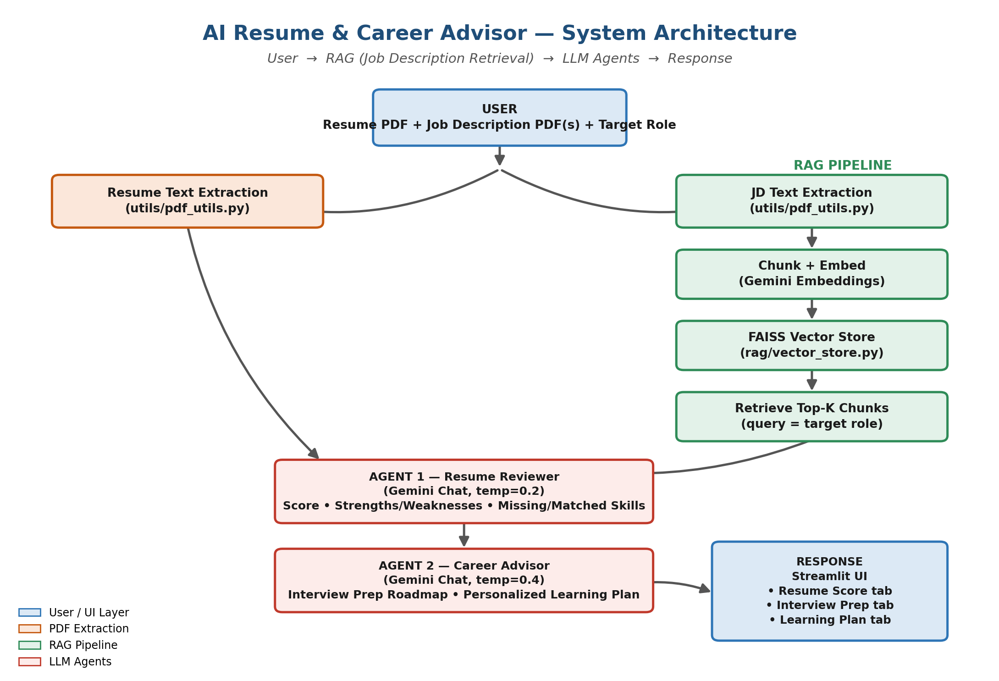

# AI Resume & Career Advisor

An AI-powered app that scores a resume against a target role, identifies skill gaps
using RAG over real job descriptions, and generates an interview prep roadmap plus
a personalized learning plan.

## Architecture

```
User (uploads resume + job description PDFs)
        │
        ▼
   RAG Layer (rag/vector_store.py)
   - Chunk job description PDFs
   - Embed with OpenAI embeddings
   - Store in FAISS
   - Retrieve top-k relevant chunks for the target role
        │
        ▼
   Resume Reviewer Agent (agents/resume_reviewer.py)
   - Scores resume (0-100) with sub-scores
   - Diffs resume skills vs. retrieved JD requirements
   - Outputs: strengths, weaknesses, missing/matched skills, quick fixes
        │
        ▼
   Career Advisor Agent (agents/career_advisor.py)
   - Interview prep roadmap (technical/behavioral Qs, 1-week plan)
   - Personalized N-month learning plan (stretch goal)
        │
        ▼
   Response (Streamlit UI, app.py)
```

## Features (maps to assignment requirements)

| Requirement | Implementation |
|---|---|
| Prompt Engineering — resume analysis | `prompts/templates.py::RESUME_ANALYSIS_PROMPT` |
| Prompt Engineering — skill gap identification | Same prompt; `missing_skills` / `matched_skills` fields |
| RAG — retrieve job descriptions from PDFs | `utils/pdf_utils.py` + `rag/vector_store.py` |
| Agent — resume reviewer | `agents/resume_reviewer.py` |
| Agent — career advisor | `agents/career_advisor.py` |
| Output — resume score | Tab 1 in `app.py` |
| Output — missing skills | Tab 1 in `app.py` |
| Output — interview prep roadmap | Tab 2 in `app.py` |
| Stretch — 3-month learning plan | Tab 3 in `app.py` (timeframe selectable: 1/3/6 months) |

## Setup

```bash
pip install -r requirements.txt
cp .env.example .env
# edit .env and add your OPENAI_API_KEY

streamlit run app.py
```

## Usage

1. Enter your target role (e.g. "Backend Software Engineer").
2. Upload your resume as a PDF.
3. Optionally upload one or more job description PDFs — these get embedded into a
   FAISS index and retrieved to ground the skill-gap analysis in real requirements
   instead of the model guessing.
4. Click **Analyze Resume**. Three tabs populate:
   - **Resume Score** — overall score, breakdown, strengths/weaknesses, missing vs.
     matched skills, and concrete rewrite suggestions.
   - **Interview Prep** — likely topics, technical/behavioral questions tailored to
     your actual background, questions to ask the interviewer, and a 1-week prep plan.
   - **Learning Plan** — a milestone-based plan (goals, resources, deliverables) to
     close the identified skill gaps over your chosen timeframe.

## Evaluation notes (for the report)

- **Prompt design**: prompts force strict JSON output with a fixed schema so the UI
  can render deterministically; system prompts set role/tone; user prompts are
  truncated defensively (`resume_text[:8000]`) to control token cost.
- **RAG grounding**: without a job description upload, the model falls back to
  general knowledge of the target role — worth calling out as a limitation and a
  good "Challenges" talking point in the report (retrieval quality depends entirely
  on the JD PDFs provided).
- **Possible extensions**: swap `ChatOpenAI`/`OpenAIEmbeddings` for Gemini or a local
  model; add a "compare across multiple JDs" mode; cache the FAISS index to disk
  (`config.VECTOR_STORE_DIR`) so repeat runs on the same JDs skip re-embedding.

## Tech stack used

- Python, LangChain, OpenAI API (chat + embeddings)
- FAISS (vector store)
- Streamlit (UI)
- pypdf (PDF text extraction)


